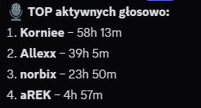
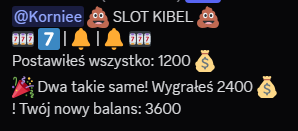
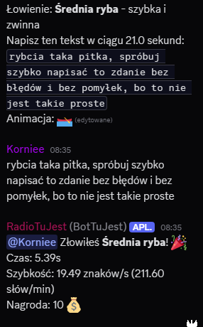
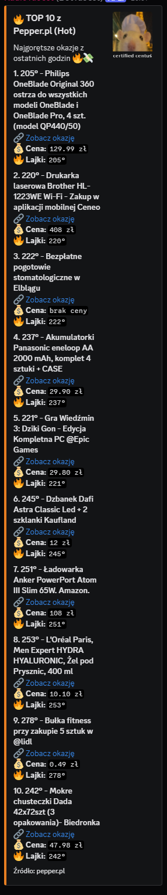
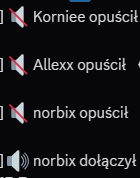

# Discord Bot

**Discord Bot** – wielofunkcyjny bot do serwera Discord, napisany w Pythonie z wykorzystaniem biblioteki `discord.py`.  
Projekt zawiera system gier, ekonomii, pogodę, RSS, muzykę i wiele innych.

---

## Funkcjonalności

- **Ekonomia**: balans użytkowników, codzienne nagrody, minigry
- **Minigry**: 
  - 🎰 Sloty
  - 🃏 Blackjack
  - 🎣 Lowienie ryb (gra na szybkość pisania)
- **Muzyka**:
  - Odtwarzanie radia i dźwięku z YouTube (yt-dlp) – **tylko w celach edukacyjnych**
- **RSS/Feed**:
  - Automatyczne pobieranie i publikowanie nowych wpisów z RSS (Pepper, inne feedy)
- **Pogoda**:
  - Prognoza pogody (teraz, jutro, 5 dni) oparta o OpenWeatherMap
- **Statystyki aktywności głosowej**:
  - Zliczanie czasu spędzonego na kanałach głosowych i ranking
- **Inne**:
  - Komendy typu `*ping`, `*restart`, `*komendy`, logowanie wejść/wyjść na VC

---
## Przykłady działania

### Ranking aktywności głosowej

### Sloty – minigra

### Gra w łowienie ryb

### Okazje z Pepper.pl

### Wpis z RSS (stealalert)

### Logi kanału głosowego

### Odtwarzanie z YouTube (educational)

## Struktura projektu
'''
DISCORDBOT/
│
├── bot.py  
├── config.py  
├── requirements.txt
│
└── commands/
├── activity_reward.py
├── blackjack.py
├── database.py
├── economy.py
├── join.py
├── komendy.py
├── leave.py
├── logi.py
├── lowisko.py
├── pepper.py
├── ping.py
├── play.py
├── playyt.py
├── pogoda.py
├── restart.py
├── slots.py
└── stealalert_feed.py
'''
##

## Wymagania

Plik `requirements.txt` zawiera wszystkie niezbędne zależności:

## Jak uruchomić bota?
Stwórz plik config.py w katalogu głównym:

TOKEN = "TWÓJ_TOKEN_BOTA"
OWNER_ID = 123456789012345678  # ID właściciela bota

Terminal : python bot.py

Uwaga dot. muzyki i YouTube
Discord nie wspiera bezpośredniego streamowania z YouTube w botach.
Kod w module playyt.py jest przykładem edukacyjnym – w przyszłości może przestać działać.

Autor : norb1x
